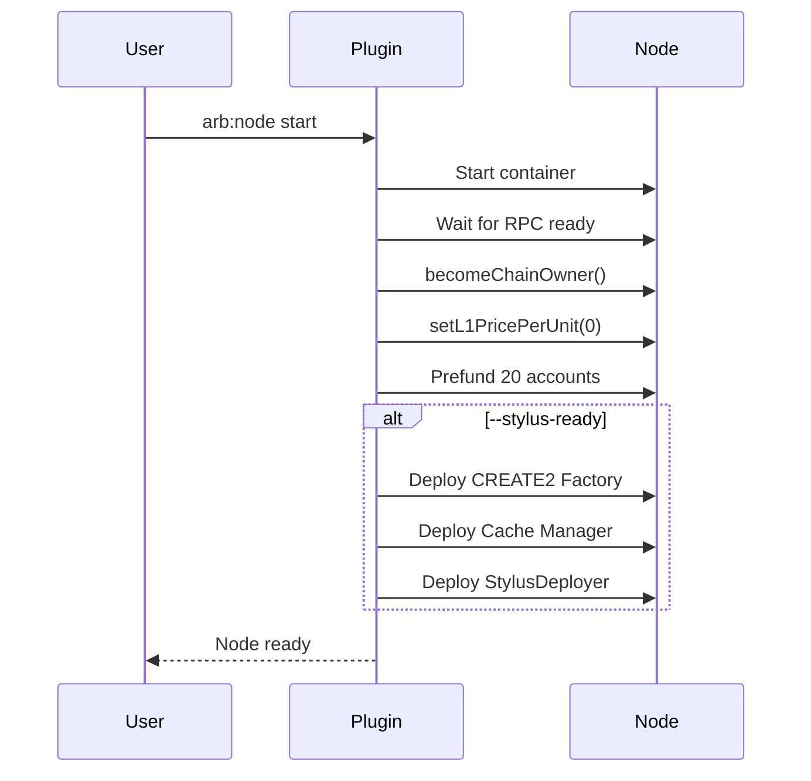

# Chain Setup

<!-- 
=============================================================================
CONTENT DESCRIPTION FOR DOCUMENTATION AGENT
=============================================================================

This page explains the chain setup process for the local Arbitrum node.

WHAT TO WRITE:
- What happens when the node starts
- Chain ownership setup
- Account prefunding
- L1 price configuration
- Stylus infrastructure deployment
- ArbOwner precompile usage

SECTIONS TO INCLUDE:

1. Overview
   - What chain setup accomplishes
   - Why it's needed

2. Chain Ownership
   - ArbOwner precompile
   - becomeChainOwner process
   - Why chain ownership is needed

3. L1 Price Configuration
   - Setting L1 price to 0
   - Why this matters for development

4. Account Prefunding
   - Hardhat's 20 default accounts
   - Chain owner account
   - Transfer amounts

5. Stylus Infrastructure (--stylus-ready)
   - CREATE2 Factory deployment
   - Cache Manager deployment
   - StylusDeployer deployment
   - Why each is needed

6. Transaction Utilities
   - How transactions are sent
   - RPC interactions

REFERENCE MATERIALS:
- packages/hardhat-arb-node/src/tasks/start.ts
- packages/hardhat-arb-node/src/utils/transactions.ts
- packages/hardhat-arb-node/src/config/defaults.ts
- packages/hardhat-arb-node/src/constants/bytecode.ts
- Arbitrum ArbOwner documentation

KEY FUNCTIONS FROM SOURCE:
- performEssentialSetup: Chain ownership + L1 price
- prefundAccounts: Fund Hardhat accounts
- deployCreate2Factory: Deploy CREATE2
- deployCacheManager: Deploy and register cache manager
- deployStylusDeployer: Deploy Stylus deployer

=============================================================================
-->

This page explains what happens during chain setup when the local Arbitrum node starts.

## Overview

When you run `arb:node start`, the plugin:

1. Starts the nitro-devnode container
2. Waits for RPC to be ready
3. Performs chain setup (ownership, L1 price)
4. Prefunds development accounts
5. Optionally deploys Stylus infrastructure

## Setup Sequence



## Chain Ownership

### Why Chain Ownership?

The dev account needs chain owner privileges to:

- Set L1 gas price to 0
- Register WASM cache managers
- Configure chain parameters

### ArbOwner Precompile

Arbitrum chains have precompiled contracts for chain management. The ArbOwner precompile (`0x0000000000000000000000000000000000000070`) controls chain parameters.

### Becoming Chain Owner

```typescript
async function becomeChainOwner(rpcUrl: string, privateKey: Hex): Promise<void> {
  // Call ArbDebug.becomeChainOwner()
  // This only works on dev nodes
}
```

## L1 Price Configuration

### Why Set L1 Price to 0?

Arbitrum transactions have two cost components:

1. **L2 execution cost** — Gas for execution
2. **L1 data cost** — Cost to post calldata to L1

For local development, we set L1 price to 0 to:

- Simplify gas estimation
- Reduce transaction costs
- Match expectations from other dev networks

```typescript
async function setL1PricePerUnit(
  rpcUrl: string,
  privateKey: Hex,
  price: bigint
): Promise<void> {
  // Call ArbOwner.setL1PricePerUnit(0)
}
```

## Account Prefunding

### Hardhat Accounts

The plugin funds Hardhat's 20 standard development accounts with 10 ETH each:

| Account | Address | Balance |
|---------|---------|---------|
| #0 | `0xf39Fd6e51aad88F6F4ce6aB8827279cffFb92266` | 10 ETH |
| #1 | `0x70997970C51812dc3A010C7d01b50e0d17dc79C8` | 10 ETH |
| ... | ... | 10 ETH |
| #19 | `0x8626f6940E2eb28930eFb4CeF49B2d1F2C9C1199` | 10 ETH |

These are the same accounts used by `npx hardhat node`.

### Chain Owner Account

Account #20 is the pre-funded dev account from nitro-devnode:

| Account | Address | Balance | Special |
|---------|---------|---------|---------|
| #20 | `0x3f1Eae7D46d88F08fc2F8ed27FCb2AB183EB2d0E` | ~800 ETH | Chain Owner |

```typescript
async function prefundAccounts(
  rpcUrl: string,
  privateKey: Hex,
  quiet: boolean
): Promise<void> {
  const amount = 10_000_000_000_000_000_000n; // 10 ETH
  
  for (const account of HARDHAT_ACCOUNTS) {
    await sendEth(rpcUrl, privateKey, account.address, amount);
  }
}
```

## Stylus Infrastructure

When using `--stylus-ready`, additional contracts are deployed:

### CREATE2 Factory

Enables deterministic contract deployment (same address across networks).

```typescript
async function deployCreate2Factory(
  rpcUrl: string,
  privateKey: Hex
): Promise<void> {
  // Fund the deterministic deployer address
  await sendEth(rpcUrl, privateKey, CREATE2_FACTORY.DEPLOYER, 1e18);
  
  // Send pre-signed deployment transaction
  await sendRawTransaction(rpcUrl, CREATE2_FACTORY_TX);
}
```

**Address:** `0x4e59b44847b379578588920cA78FbF26c0B4956C`

### Cache Manager

Manages WASM caching for Stylus contracts. Caching improves execution performance.

```typescript
async function deployCacheManager(
  rpcUrl: string,
  privateKey: Hex
): Promise<Hex> {
  // Deploy the contract
  const { contractAddress } = await deployContract(
    rpcUrl,
    privateKey,
    CACHE_MANAGER_BYTECODE
  );
  
  // Register with ArbOwner
  await addWasmCacheManager(rpcUrl, privateKey, contractAddress);
  
  return contractAddress;
}
```

### StylusDeployer

Helper contract that simplifies Stylus contract deployment.

```typescript
async function deployStylusDeployer(
  rpcUrl: string,
  privateKey: Hex
): Promise<Hex> {
  // Deploy via CREATE2 for deterministic address
  const { contractAddress } = await deployViaCreate2(
    rpcUrl,
    privateKey,
    DEFAULT_SALT,
    STYLUS_DEPLOYER_BYTECODE
  );
  
  return contractAddress;
}
```

## Transaction Utilities

The plugin uses viem for RPC interactions:

```typescript
// packages/hardhat-arb-node/src/utils/transactions.ts

export async function sendEth(
  rpcUrl: string,
  privateKey: Hex,
  to: Hex,
  amount: bigint
): Promise<Hex> {
  const client = createWalletClient({
    account: privateKeyToAccount(privateKey),
    transport: http(rpcUrl),
  });
  
  return client.sendTransaction({ to, value: amount });
}

export async function deployContract(
  rpcUrl: string,
  privateKey: Hex,
  bytecode: Hex
): Promise<{ contractAddress: Hex }> {
  // Deploy contract and wait for receipt
}
```

## Summary

| Step | Purpose | Required |
|------|---------|----------|
| Chain Ownership | Enable chain configuration | Always |
| L1 Price = 0 | Simplify gas costs | Always |
| Prefund Accounts | Development convenience | Always |
| CREATE2 Factory | Deterministic deployment | `--stylus-ready` |
| Cache Manager | WASM caching | `--stylus-ready` |
| StylusDeployer | Stylus deployment helper | `--stylus-ready` |
