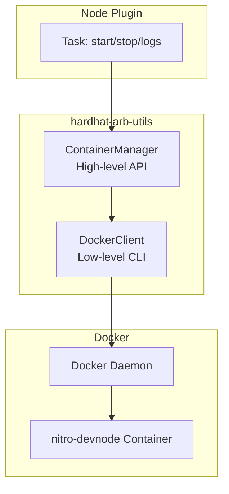
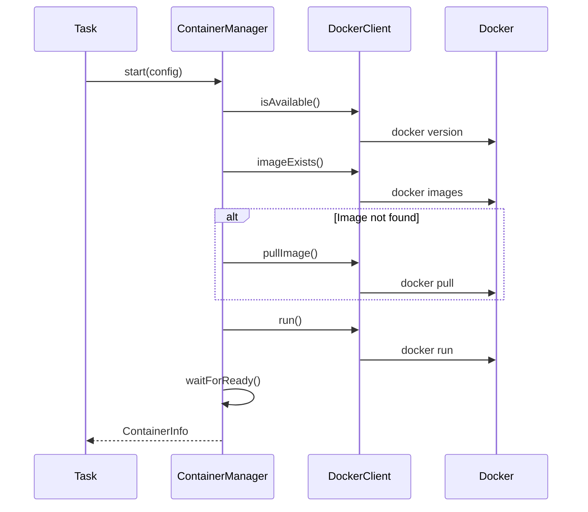
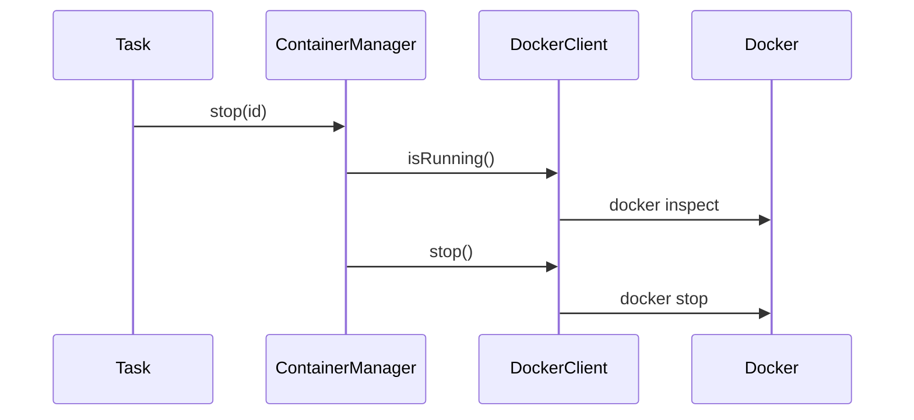

# Container Management

<!-- 
=============================================================================
CONTENT DESCRIPTION FOR DOCUMENTATION AGENT
=============================================================================

This page explains the Docker container management architecture.

WHAT TO WRITE:
- How the plugin manages Docker containers
- ContainerManager architecture
- DockerClient implementation
- Container lifecycle (start, stop, health checks)
- Readiness checks (HTTP, TCP, exec)
- Error handling patterns

SECTIONS TO INCLUDE:

1. Overview
   - Why Docker for local node
   - Container vs native process

2. Architecture
   - Diagram of container management layers
   - ContainerManager (high-level)
   - DockerClient (low-level)

3. ContainerManager
   - Responsibilities
   - API surface
   - Managed container tracking

4. DockerClient
   - Low-level Docker CLI wrapper
   - Commands: run, stop, logs, inspect
   - Error handling

5. Container Lifecycle
   - Starting: pull image, run container, wait for ready
   - Running: health monitoring
   - Stopping: graceful shutdown, cleanup

6. Readiness Checks
   - HTTP check (RPC endpoint)
   - TCP check (port availability)
   - Exec check (command in container)

7. Configuration
   - ContainerConfig interface
   - Port mapping
   - Auto-remove behavior

REFERENCE MATERIALS:
- packages/hardhat-arb-utils/src/container/container-manager.ts
- packages/hardhat-arb-utils/src/container/docker-client.ts
- packages/hardhat-arb-utils/src/container/types.ts

=============================================================================
-->

This page explains how the plugin manages Docker containers for the local Arbitrum node.

## Overview

<!-- 
Why Docker:
- Consistent environment
- Easy setup (no manual node installation)
- Isolated from host system
- Version pinning
-->

The plugin uses Docker to run the Arbitrum nitro-devnode because:

- **Consistent environment** across all platforms
- **Easy setup** — no manual node compilation
- **Isolation** from the host system
- **Version control** via image tags

## Architecture



## ContainerManager

High-level container lifecycle management.

### Responsibilities

- Ensure Docker is available
- Pull images if not present
- Start containers with configuration
- Wait for readiness
- Stop and cleanup containers

### API

```typescript
class ContainerManager {
  // Start a container with config
  async start(config: ContainerConfig): Promise<ContainerInfo>;
  
  // Stop a container
  async stop(containerId: string): Promise<void>;
  
  // Remove a container
  async remove(containerId: string): Promise<void>;
  
  // Check if running
  async isRunning(containerId: string): Promise<boolean>;
  
  // Get logs
  async logs(containerId: string, tail?: number): Promise<string>;
  
  // Stream logs (returns ChildProcess)
  streamLogs(containerId: string): ChildProcess;
  
  // Wait for readiness
  async waitForReady(info: ContainerInfo, check: ReadinessCheck): Promise<void>;
}
```

### Usage in Node Plugin

```typescript
const manager = new ContainerManager();

// Start with configuration
const containerInfo = await manager.start({
  image: 'offchainlabs/nitro-node',
  tag: 'v3.7.1-926f1ab',
  name: 'nitro-devnode',
  ports: [
    { host: 8547, container: 8547 },
    { host: 8548, container: 8548 },
  ],
  readinessCheck: {
    type: 'http',
    target: 'http://localhost:8547',
    timeout: 60000,
    interval: 1000,
  },
});

// Later: stop
await manager.stop(containerInfo.id);
```

## DockerClient

Low-level wrapper around the Docker CLI.

### Commands

| Method | Docker Command |
|--------|---------------|
| `run(config)` | `docker run` |
| `stop(id)` | `docker stop` |
| `remove(id)` | `docker rm` |
| `logs(id)` | `docker logs` |
| `inspect(id)` | `docker inspect` |
| `isRunning(id)` | `docker inspect` |
| `pullImage(image, tag)` | `docker pull` |
| `imageExists(image, tag)` | `docker images` |
| `findByName(name)` | `docker ps -a` |

### Error Handling

```typescript
class DockerError extends Error {
  constructor(message: string, public readonly exitCode?: number) {
    super(message);
    this.name = 'DockerError';
  }
}
```

## Container Lifecycle

### Starting



### Stopping



## Readiness Checks

The plugin waits for the container to be ready before returning.

### HTTP Check (Default)

Polls an HTTP endpoint until it responds:

```typescript
readinessCheck: {
  type: 'http',
  target: 'http://localhost:8547',
  timeout: 60000,
  interval: 1000,
}
```

Implementation sends a JSON-RPC request:

```typescript
private async httpReadinessCheck(url: string): Promise<boolean> {
  const response = await fetch(url, {
    method: 'POST',
    headers: { 'Content-Type': 'application/json' },
    body: JSON.stringify({
      jsonrpc: '2.0',
      method: 'eth_chainId',
      params: [],
      id: 1,
    }),
  });
  return response.ok;
}
```

### TCP Check

Checks if a port is open:

```typescript
readinessCheck: {
  type: 'tcp',
  target: 'localhost:8547',
  timeout: 60000,
  interval: 1000,
}
```

### Exec Check

Runs a command inside the container:

```typescript
readinessCheck: {
  type: 'exec',
  target: 'curl -s http://localhost:8547',
  timeout: 60000,
  interval: 1000,
}
```

## Configuration Types

```typescript
interface ContainerConfig {
  image: string;
  tag: string;
  name?: string;
  ports: PortMapping[];
  command?: string[];
  readinessCheck?: ReadinessCheck;
  autoRemove?: boolean;
  detach?: boolean;
}

interface PortMapping {
  host: number;
  container: number;
}

interface ReadinessCheck {
  type: 'http' | 'tcp' | 'exec';
  target: string;
  timeout: number;
  interval: number;
}
```
