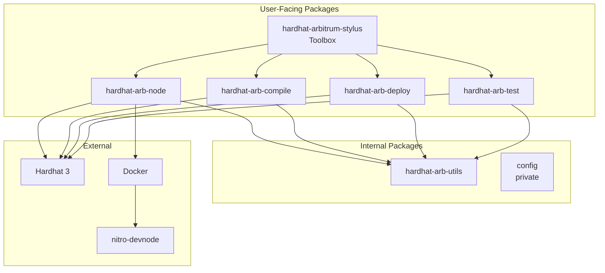

# Architecture Overview

<!-- 
=============================================================================
CONTENT DESCRIPTION FOR DOCUMENTATION AGENT
=============================================================================

This is the main architecture overview page for CONTRIBUTORS.

WHAT TO WRITE:
- High-level architecture of the plugin suite
- How the plugins fit together
- Design decisions and rationale
- Technology stack
- Diagrams showing component relationships

SECTIONS TO INCLUDE:

1. Introduction
   - Purpose of this section (for contributors)
   - Who should read this

2. High-Level Architecture
   - Diagram showing plugin relationships
   - Toolbox as composition plugin
   - Individual plugins and their responsibilities
   - Shared utilities package

3. Technology Stack
   - Hardhat 3 plugin system
   - TypeScript
   - Docker for local node
   - viem for web3 interactions

4. Design Principles
   - Minimal, simple code
   - Composition over inheritance
   - Plugin isolation
   - Type safety

5. Package Relationships
   - Dependency graph
   - Public vs internal packages

6. Data Flow
   - How configuration flows
   - How tasks execute
   - How hooks integrate

7. Next Steps
   - Links to detailed architecture pages

REFERENCE MATERIALS:
- All package index.ts files
- Package.json files for dependencies
- Hardhat 3 plugin documentation
- Repository README

=============================================================================
-->

This section explains the internal architecture of Hardhat Arbitrum Stylus for contributors and those who want to understand how the plugin works.

## Who Should Read This

This documentation is for:

- Contributors who want to understand the codebase
- Developers extending the plugin
- Anyone curious about the internals

For user documentation, see [Getting Started](../getting-started/index.md).

## High-Level Architecture



## Package Overview

| Package | Type | Purpose |
|---------|------|---------|
| `hardhat-arbitrum-stylus` | Public | Toolbox - bundles all plugins |
| `hardhat-arb-node` | Public | Local node management |
| `hardhat-arb-compile` | Public | Contract compilation |
| `hardhat-arb-deploy` | Public | Contract deployment |
| `hardhat-arb-test` | Public | Test runner |
| `hardhat-arb-utils` | Public | Shared utilities |
| `config` | Private | Shared configuration (ESLint, TypeScript) |

## Design Principles

### 1. Minimal, Simple Code

<!-- 
Explain the "no over-engineering" principle
-->

We prioritize simplicity over abstraction. Code should be easy to read and understand without extensive documentation.

### 2. Plugin Composition

The toolbox doesn't implement features directly. It composes individual plugins:

```typescript
const hardhatArbitrumStylusPlugin: HardhatPlugin = {
  id: 'hardhat-arbitrum-stylus',
  dependencies: () => [
    import('@cobuilders/hardhat-arb-node'),
    import('@cobuilders/hardhat-arb-compile'),
    // ...
  ],
};
```

### 3. Plugin Isolation

Each plugin can be used independently. Dependencies are explicit and minimal.

### 4. Type Safety

Full TypeScript with strict mode. Configuration types are exported for user consumption.

## Technology Stack

| Layer | Technology |
|-------|------------|
| Plugin System | Hardhat 3 |
| Language | TypeScript (ESM) |
| Container | Docker |
| Local Node | nitro-devnode |
| Web3 | viem |
| Testing | Node.js test runner |

## Repository Structure

```
hardhat-arbitrum-stylus/
├── packages/
│   ├── config/                    # Shared dev configuration
│   ├── hardhat-arb-compile/       # Compile plugin
│   ├── hardhat-arb-deploy/        # Deploy plugin
│   ├── hardhat-arb-node/          # Node plugin
│   ├── hardhat-arb-test/          # Test plugin
│   ├── hardhat-arb-utils/         # Shared utilities
│   └── hardhat-arbitrum-stylus/   # Toolbox plugin
├── docs/                          # Documentation (you are here)
├── .changeset/                    # Version management
└── pnpm-workspace.yaml            # Monorepo config
```

## Next Steps

Dive deeper into specific areas:

- [Plugin System](plugin-system.md) — How Hardhat 3 plugins work
- [Container Management](container-management.md) — Docker integration
- [Chain Setup](chain-setup.md) — Local chain configuration
- [Package Structure](package-structure.md) — Monorepo organization
