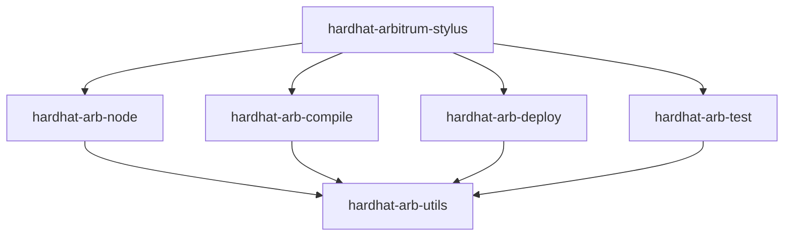

# Package Structure

<!-- 
=============================================================================
CONTENT DESCRIPTION FOR DOCUMENTATION AGENT
=============================================================================

This page explains the monorepo structure and package organization.

WHAT TO WRITE:
- Monorepo structure with pnpm workspaces
- Package responsibilities
- Dependency relationships
- Build and test setup
- Shared configuration

SECTIONS TO INCLUDE:

1. Monorepo Overview
   - Why monorepo
   - pnpm workspaces configuration

2. Package Layout
   - Directory structure
   - Package naming conventions

3. Package Types
   - Public packages (published to npm)
   - Private packages (internal only)

4. Dependency Graph
   - Visual dependency relationships
   - Peer dependencies vs regular

5. Shared Configuration
   - config package
   - ESLint, TypeScript configs

6. Build System
   - TypeScript compilation
   - Build order

7. Testing Structure
   - Test locations
   - Fixture projects

REFERENCE MATERIALS:
- pnpm-workspace.yaml
- Root package.json
- Individual package.json files
- packages/config/ contents

=============================================================================
-->

This page explains the monorepo structure and package organization.

## Monorepo Overview

The repository uses **pnpm workspaces** for monorepo management:

```yaml
# pnpm-workspace.yaml
packages:
  - 'packages/*'
```

### Benefits

- **Shared dependencies** — Single lockfile, deduped packages
- **Atomic commits** — Related changes across packages together
- **Simplified testing** — Easy cross-package integration tests
- **Coordinated releases** — Changesets manages versions

## Directory Structure

```
hardhat-arbitrum-stylus/
├── packages/
│   ├── config/                    # Private: Shared dev config
│   ├── hardhat-arb-compile/       # Public: Compile plugin
│   ├── hardhat-arb-deploy/        # Public: Deploy plugin
│   ├── hardhat-arb-node/          # Public: Node plugin
│   ├── hardhat-arb-test/          # Public: Test plugin
│   ├── hardhat-arb-utils/         # Public: Shared utilities
│   └── hardhat-arbitrum-stylus/   # Public: Toolbox plugin
├── docs/                          # Documentation
├── .changeset/                    # Version management
├── .github/                       # CI/CD workflows
├── package.json                   # Root workspace config
├── pnpm-lock.yaml                 # Lockfile
└── pnpm-workspace.yaml            # Workspace definition
```

## Package Types

### Public Packages

Published to npm under `@cobuilders` scope:

| Package | npm Name |
|---------|----------|
| hardhat-arbitrum-stylus | `@cobuilders/hardhat-arbitrum-stylus` |
| hardhat-arb-node | `@cobuilders/hardhat-arb-node` |
| hardhat-arb-compile | `@cobuilders/hardhat-arb-compile` |
| hardhat-arb-deploy | `@cobuilders/hardhat-arb-deploy` |
| hardhat-arb-test | `@cobuilders/hardhat-arb-test` |
| hardhat-arb-utils | `@cobuilders/hardhat-arb-utils` |

### Private Packages

Internal packages not published:

| Package | Purpose |
|---------|---------|
| config | Shared ESLint and TypeScript configuration |

## Dependency Graph



### Dependency Rules

1. **Toolbox** depends on all plugins (composition)
2. **Plugins** depend on utils (shared code)
3. **Utils** has no internal dependencies
4. **No circular dependencies**

## Individual Package Structure

Each package follows a consistent structure:

```
hardhat-arb-node/
├── src/
│   ├── index.ts           # Plugin entry point
│   ├── type-extensions.ts # TypeScript declarations
│   ├── config/            # Configuration handling
│   ├── hook-handlers/     # Hardhat hooks
│   ├── tasks/             # Task implementations
│   └── utils/             # Package-specific utilities
├── test/
│   ├── fixture-projects/  # Test fixtures
│   └── *.ts               # Test files
├── dist/                  # Compiled output
├── package.json
├── tsconfig.json
├── eslint.config.js
├── CHANGELOG.md
└── README.md
```

## Shared Configuration

The `config` package provides shared development configuration:

```
packages/config/
├── eslint.config.js       # ESLint rules
├── tsconfig.base.json     # Base TypeScript config
├── package.json
└── README.md
```

### Usage in Packages

```javascript
// eslint.config.js
import config from '@cobuilders/config/eslint.config.js';
export default config;
```

```json
// tsconfig.json
{
  "extends": "@cobuilders/config/tsconfig.base.json",
  "compilerOptions": {
    "outDir": "./dist"
  }
}
```

## Build System

### Scripts

Root `package.json` defines workspace-wide scripts:

```json
{
  "scripts": {
    "build": "pnpm run --recursive build",
    "test": "pnpm run --recursive test",
    "lint": "pnpm run --recursive lint",
    "format": "pnpm run --recursive format"
  }
}
```

### Build Order

pnpm respects dependency order. When running `pnpm build`:

1. `config` builds first (no deps)
2. `hardhat-arb-utils` builds (depends on config)
3. Individual plugins build (depend on utils)
4. `hardhat-arbitrum-stylus` builds last (depends on all)

### Individual Package Build

```json
{
  "scripts": {
    "build": "tsc --build",
    "clean": "rm -rf dist"
  }
}
```

## Testing Structure

### Test Location

Tests live in each package's `test/` directory:

```
packages/hardhat-arb-node/test/
├── fixture-projects/
│   ├── node-plugin/
│   │   ├── hardhat.config.ts
│   │   └── package.json
│   └── node-plugin-custom-config/
│       └── ...
├── index.ts               # Test setup
├── start.ts               # Start task tests
└── network-hook.ts        # Hook tests
```

### Fixture Projects

Test fixtures are minimal Hardhat projects:

```typescript
// test/fixture-projects/node-plugin/hardhat.config.ts
import hardhatArbNode from '@cobuilders/hardhat-arb-node';

export default {
  plugins: [hardhatArbNode],
};
```

### Running Tests

```bash
# All packages
pnpm test

# Single package
cd packages/hardhat-arb-node
pnpm test
```

## Package.json Conventions

### Common Fields

```json
{
  "name": "@cobuilders/hardhat-arb-node",
  "version": "0.1.0",
  "type": "module",
  "main": "dist/src/index.js",
  "types": "dist/src/index.d.ts",
  "exports": {
    ".": "./dist/src/index.js"
  },
  "files": ["dist/", "README.md"],
  "peerDependencies": {
    "hardhat": "^3.0.0"
  }
}
```

### Peer Dependencies

Hardhat is a peer dependency to:

- Avoid version conflicts
- Let users control Hardhat version
- Ensure single Hardhat instance
