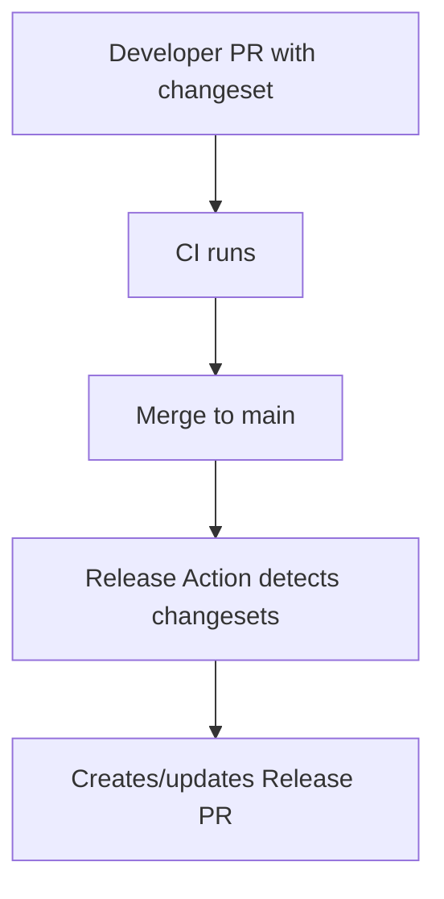
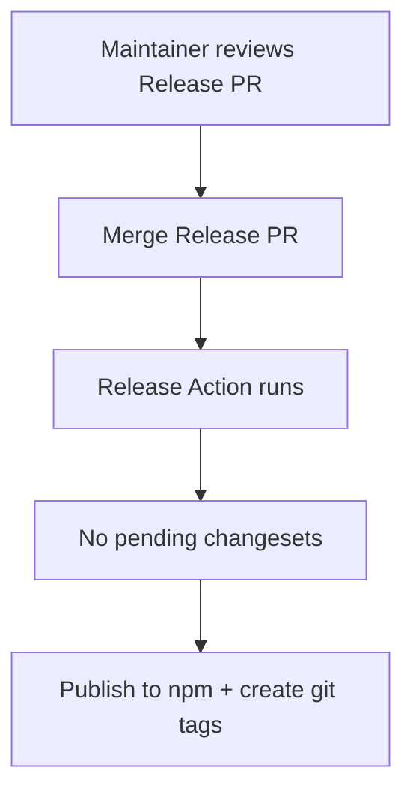

# Versioning & Releases

<!-- 
=============================================================================
CONTENT DESCRIPTION FOR DOCUMENTATION AGENT
=============================================================================

This page covers versioning and release strategy in detail.
Based on existing VERSION-CONTROL-AND-PUBLISHING.md.

WHAT TO WRITE:
- How versioning works
- Semantic versioning rules
- Changesets workflow
- Release automation
- Pre-release versions
- Changelog generation

REFERENCE MATERIALS:
- Existing docs/VERSION-CONTROL-AND-PUBLISHING.md (migrate content here)
- Changesets documentation
- GitHub Actions workflows

=============================================================================
-->

This document describes how versioning, releases, and publishing work in the repository.

## Overview

The project uses:

- **pnpm workspaces** — Monorepo management
- **Changesets** — Version management and changelog generation
- **GitHub Actions** — Automated CI/CD and npm publishing

All releases are automated. There is no manual publishing workflow for stable releases.

## Package Structure

```
hardhat-arbitrum-stylus/
├── packages/
│   ├── config/                      # Private — shared configuration
│   ├── hardhat-arb-compile/         # @cobuilders/hardhat-arb-compile
│   ├── hardhat-arb-deploy/          # @cobuilders/hardhat-arb-deploy
│   ├── hardhat-arb-node/            # @cobuilders/hardhat-arb-node
│   ├── hardhat-arb-test/            # @cobuilders/hardhat-arb-test
│   └── hardhat-arbitrum-stylus/     # @cobuilders/hardhat-arbitrum-stylus
```

The `config` package is private and never published.

## Versioning Strategy

### Independent Versioning

Each package maintains its own version number. A change to `hardhat-arb-compile` does not force a version bump on `hardhat-arb-deploy`.

This approach:

- Avoids unnecessary version churn
- Lets consumers update only what they need
- Keeps changelogs focused and relevant

### Semantic Versioning

All packages follow semver:

| Bump | When to use |
|------|-------------|
| **patch** | Bug fixes, backwards compatible |
| **minor** | New features, backwards compatible |
| **major** | Breaking changes |

## How Changesets Work

Changesets capture the _intent_ of a change at development time.

### The Changeset File

When a developer runs `pnpm changeset`, a markdown file is created in `.changeset/`:

```markdown
---
'@cobuilders/hardhat-arb-compile': minor
---

Added support for Stylus SDK paths
```

This file declares:

- Which packages are affected
- What type of version bump each needs
- A human-readable description for the changelog

### Why This Approach

- **Decoupled from releases** — Changes accumulate until maintainers decide to release
- **Atomic** — Multiple packages can be released together with consistent versions
- **Traceable** — Each changelog entry links back to the work that produced it

## The Release Flow

Releases are fully automated via GitHub Actions.

### Phase 1: Accumulating Changes



After each merge to `main`, the release workflow checks for pending changesets. If any exist, it opens (or updates) a **Release PR** that contains:

- Version bumps in `package.json` files
- Updated `CHANGELOG.md` files
- Updated lockfile

### Phase 2: Publishing



When the Release PR is merged:

1. The release workflow runs again
2. It finds no pending changesets
3. It publishes all packages with new versions to npm
4. It creates git tags for each published package

!!! note "Publishing Trigger"
    Publishing **only** happens when the Release PR is merged.

## Branch Protection

The `main` branch is protected:

- Pull request reviews required
- Status checks must pass
- Branches must be up to date before merging
- Linear history enforced (squash merges)

## CI Workflows

### CI Workflow (Every PR)

- Builds all packages
- Runs all tests
- Runs linting
- Checks that a changeset exists

### Release Workflow (Push to main)

1. Checks for pending changesets
2. If changesets exist → creates/updates Release PR
3. If no changesets AND unpublished version bumps → publishes packages

## Pre-release Versions

For testing changes before a stable release:

### Entering Pre-release Mode

```bash
pnpm changeset pre enter alpha
```

Versions become: `0.1.0-alpha.0`, `0.1.0-alpha.1`, etc.

### Publishing a Pre-release

```bash
# Create changesets as normal
pnpm changeset

# Version packages (produces alpha versions)
pnpm version-for-release

# Publish with a dist-tag
pnpm changeset publish --tag alpha
```

### Exiting Pre-release Mode

```bash
pnpm changeset pre exit
```

## Changelog Generation

Changelogs are generated automatically from changeset descriptions.

### Writing Good Changeset Descriptions

**Good:**
```
Fixed compilation failing when project path contains spaces
```

**Bad:**
```
Fixed bug
```

For breaking changes, include migration guidance:

```markdown
---
'@cobuilders/hardhat-arb-compile': major
---

Changed configuration format from array to object.

**Migration:** Update your `hardhat.config.ts`:

Before:
```ts
stylus: ['--force']
```

After:
```ts
stylus: {
  args: ['--force']
}
```
```

## npm Organization

All packages are published under the `@cobuilders` scope on npm.

- Packages are public (`access: public`)
- Publishing is handled by GitHub Actions using an npm automation token
