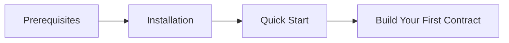

# Getting Started

<!-- 
=============================================================================
CONTENT DESCRIPTION FOR DOCUMENTATION AGENT
=============================================================================

This is the introduction page for the Getting Started section.

WHAT TO WRITE:
- Welcome developers to Arbitrum Stylus development with Hardhat
- Explain what they'll learn in this section
- Provide a roadmap of the getting started journey
- Mention the prerequisites, installation, and quick-start flow

TONE & STYLE:
- Encouraging and helpful
- Clear progression from prerequisites → installation → first project
- Highlight that Hardhat experience transfers to Stylus development

SECTIONS TO INCLUDE:
1. What you'll learn
2. Prerequisites overview (link to full page)
3. Time estimate to get started
4. Section navigation/overview

REFERENCE MATERIALS:
- Hardhat getting started documentation
- Arbitrum Stylus SDK documentation
- Package README files

=============================================================================
-->

Welcome to Hardhat Arbitrum Stylus! This section will help you set up your development environment and create your first Stylus project.

## What You'll Learn

<!-- 
List the key outcomes:
- Setting up prerequisites (Docker, Node.js, Rust)
- Installing the plugin suite
- Running a local Arbitrum node
- Understanding the development workflow
-->

## Prerequisites at a Glance

Before you begin, you'll need:

- **Node.js** v22 or later
- **Docker** installed and running
- **Rust** toolchain (for Stylus contracts)
- **pnpm**, **npm**, or **yarn** package manager

→ [Full Prerequisites Guide](prerequisites.md)

## Getting Started Path

1. **[Prerequisites](prerequisites.md)** — Install required tools
2. **[Installation](installation.md)** — Add the plugin to your project  
3. **[Quick Start](quick-start.md)** — Run your first Stylus workflow

## Time Estimate

<!-- Provide realistic time estimates for each step -->

| Step | Estimated Time |
|------|---------------|
| Prerequisites | 10-15 minutes |
| Installation | 2-3 minutes |
| Quick Start | 5-10 minutes |
