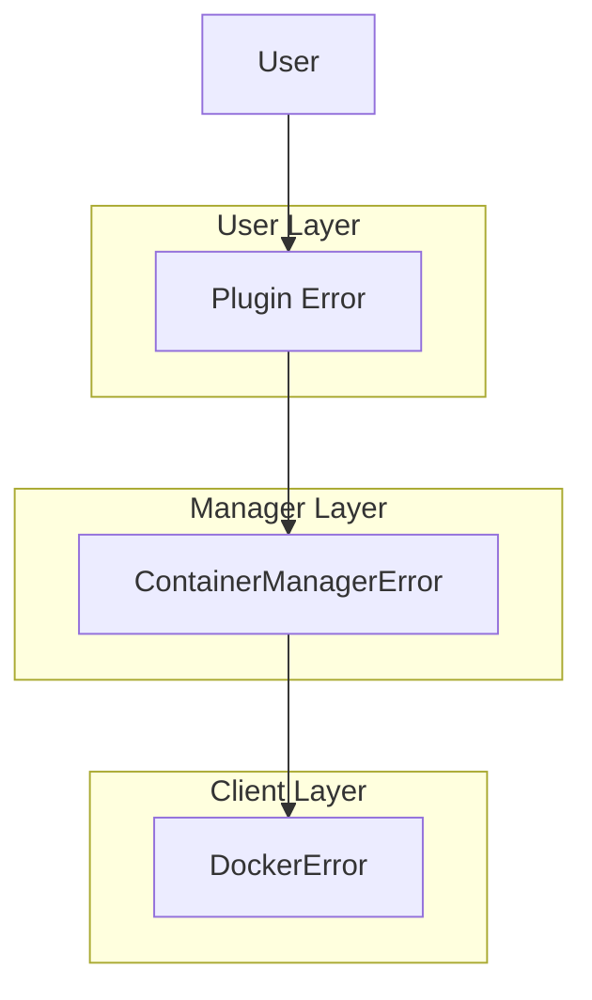

# Error Handling

<!-- 
=============================================================================
CONTENT DESCRIPTION FOR DOCUMENTATION AGENT
=============================================================================

This page documents error handling patterns used across the plugin.

WHAT TO WRITE:
- Error handling philosophy
- Custom error types
- Error propagation patterns
- User-friendly error messages
- Examples from the codebase

SECTIONS TO INCLUDE:

1. Philosophy
   - Fail fast
   - Clear messages
   - Actionable errors

2. Error Types
   - HardhatPluginError (from utils)
   - ContainerManagerError
   - DockerError
   - When to use each

3. Creating Errors
   - createPluginError helper
   - Including context
   - Error chaining

4. Error Patterns
   - Validation errors
   - Runtime errors
   - External service errors (Docker)

5. User-Friendly Messages
   - What makes a good error message
   - Examples of good messages
   - Including solutions

REFERENCE MATERIALS:
- packages/hardhat-arb-utils/src/errors/index.ts
- packages/hardhat-arb-utils/src/container/container-manager.ts
- packages/hardhat-arb-utils/src/container/docker-client.ts
- Error messages throughout the codebase

=============================================================================
-->

This page documents error handling patterns used across the plugin suite.

## Philosophy

Our error handling follows these principles:

1. **Fail fast** — Detect errors early
2. **Clear messages** — Tell users what went wrong
3. **Actionable** — Include how to fix it
4. **Preserve context** — Chain errors when wrapping

## Error Types

### HardhatPluginError

General plugin errors for user-facing issues:

```typescript
import { createPluginError } from '@cobuilders/hardhat-arb-utils';

throw createPluginError('HTTP port 8547 is already in use');
```

### ContainerManagerError

Container lifecycle errors:

```typescript
export class ContainerManagerError extends Error {
  public readonly originalCause?: Error;

  constructor(message: string, originalCause?: Error) {
    super(message);
    this.name = 'ContainerManagerError';
    this.originalCause = originalCause;
  }
}
```

### DockerError

Low-level Docker CLI errors:

```typescript
export class DockerError extends Error {
  public readonly exitCode?: number;

  constructor(message: string, exitCode?: number) {
    super(message);
    this.name = 'DockerError';
    this.exitCode = exitCode;
  }
}
```

## Error Hierarchy



## Creating Errors

### Simple Errors

```typescript
import { createPluginError } from '@cobuilders/hardhat-arb-utils';

if (await isPortInUse(httpPort)) {
  throw createPluginError(`HTTP port ${httpPort} is already in use`);
}
```

### Errors with Context

Include relevant details:

```typescript
throw createPluginError(
  `Failed to start container. ` +
  `Image: ${config.image}:${config.tag}, ` +
  `Ports: ${httpPort}, ${wsPort}`
);
```

### Error Chaining

Preserve original error:

```typescript
try {
  await this.client.run(config);
} catch (error) {
  if (error instanceof DockerError) {
    throw new ContainerManagerError(
      `Failed to start container: ${error.message}`,
      error  // Preserve original
    );
  }
  throw error;
}
```

## Error Patterns

### Validation Errors

Thrown during configuration:

```typescript
validateUserConfig: async (config) => {
  const { arbNode } = config;
  
  if (arbNode?.httpPort !== undefined) {
    if (!Number.isInteger(arbNode.httpPort)) {
      throw createPluginError(
        `arbNode.httpPort must be an integer, got: ${typeof arbNode.httpPort}`
      );
    }
    
    if (arbNode.httpPort < 1 || arbNode.httpPort > 65535) {
      throw createPluginError(
        `arbNode.httpPort must be between 1 and 65535, got: ${arbNode.httpPort}`
      );
    }
  }
};
```

### Runtime Errors

Thrown during task execution:

```typescript
const taskStart = async (args, hre) => {
  // Check prerequisites
  if (await isPortInUse(httpPort)) {
    throw createPluginError(`HTTP port ${httpPort} is already in use`);
  }
  
  // Wrap external errors
  try {
    await manager.start(containerConfig);
  } catch (error) {
    if (error instanceof ContainerManagerError) {
      throw createPluginError(
        `Failed to start Arbitrum node: ${error.message}`
      );
    }
    throw error;
  }
};
```

### External Service Errors

Docker-related errors with helpful messages:

```typescript
async ensureDockerAvailable(): Promise<void> {
  const available = await this.client.isAvailable();
  if (!available) {
    throw new ContainerManagerError(
      'Docker is not available. ' +
      'Please ensure Docker is installed and running.'
    );
  }
}
```

## User-Friendly Messages

### Good Error Message Anatomy

```
[What went wrong]: [Specific details]
[How to fix it]
```

### Examples

**Good:**
```
HTTP port 8547 is already in use.
Use --http-port to specify a different port, or stop the process using port 8547.
```

**Bad:**
```
EADDRINUSE
```

**Good:**
```
Docker is not available. Please ensure Docker is installed and running.
```

**Bad:**
```
spawn docker ENOENT
```

**Good:**
```
Failed to pull image offchainlabs/nitro-node:v3.7.1-926f1ab.
Please check your internet connection and verify the image name.
```

**Bad:**
```
Error: Command failed
```

## Testing Errors

Test that errors are thrown correctly:

```typescript
import { expect } from 'chai';

it('should throw when port is in use', async () => {
  // Setup: occupy the port
  const server = createServer().listen(8547);
  
  try {
    await expect(
      hre.run(['arb:node', 'start'])
    ).to.be.rejectedWith('port 8547 is already in use');
  } finally {
    server.close();
  }
});
```

## Best Practices Summary

1. **Use the right error type** for the layer
2. **Include actionable information** in messages
3. **Chain errors** to preserve context
4. **Test error scenarios** alongside happy paths
5. **Keep messages user-friendly**, not technical
