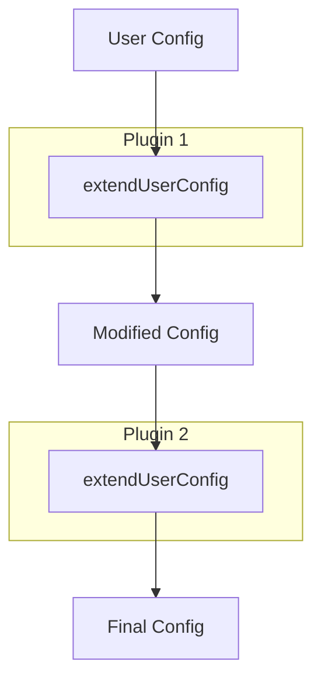

# Hook Handlers

<!-- 
=============================================================================
CONTENT DESCRIPTION FOR DOCUMENTATION AGENT
=============================================================================

This page provides deep dive into hook handler implementations.

WHAT TO WRITE:
- Detailed explanation of each hook handler type
- How our hooks are implemented
- Hook execution order
- Common patterns

SECTIONS TO INCLUDE:

1. Hook Handler Overview
   - What hooks are
   - When they're called
   - Hook types

2. Config Hook Handler
   - extendUserConfig
   - validateUserConfig
   - resolveUserConfig
   - Our implementation

3. HRE Hook Handler
   - extendHardhatRuntimeEnvironment
   - Our implementation

4. Network Hook Handler
   - resolveNetworkConfig
   - Our implementation

5. Implementation Patterns
   - Lazy loading
   - Default values
   - Validation patterns

REFERENCE MATERIALS:
- packages/hardhat-arb-node/src/hook-handlers/config.ts
- packages/hardhat-arb-node/src/hook-handlers/hre.ts
- packages/hardhat-arb-node/src/hook-handlers/network.ts
- Hardhat 3 hooks documentation

=============================================================================
-->

Deep dive into how hook handlers are implemented in the plugin.

## Overview

Hook handlers are functions that Hardhat calls at specific lifecycle points. They allow plugins to:

- Modify configuration
- Extend the runtime environment
- Customize network behavior

## Hook Types

| Hook | Purpose | When Called |
|------|---------|-------------|
| `config` | Modify and validate config | During config resolution |
| `hre` | Extend HRE | When HRE is created |
| `network` | Network-specific behavior | When network is accessed |

## Config Hook Handler

The config hook is the most complex, with multiple methods.

### Methods

```typescript
interface ConfigHookHandler {
  // Add defaults to user config
  extendUserConfig?: (config, context) => Promise<UserConfig>;
  
  // Validate the user config
  validateUserConfig?: (config) => Promise<void>;
  
  // Transform user config to resolved config
  resolveUserConfig?: (config, context) => Promise<ResolvedConfig>;
}
```

### Our Implementation

```typescript
// packages/hardhat-arb-node/src/hook-handlers/config.ts

const configHookHandler: ConfigHookHandler = {
  extendUserConfig: async (config, _context) => {
    // Merge user config with defaults
    return {
      ...config,
      arbNode: {
        ...DEFAULT_ARB_NODE_CONFIG,
        ...config.arbNode,
      },
    };
  },

  validateUserConfig: async (config) => {
    const arbNode = config.arbNode;
    
    // Validate port numbers
    if (arbNode?.httpPort !== undefined) {
      if (!Number.isInteger(arbNode.httpPort) || arbNode.httpPort < 1) {
        throw createPluginError('arbNode.httpPort must be a positive integer');
      }
    }
    
    // Additional validation...
  },

  resolveUserConfig: async (config, _context) => {
    // Transform to fully resolved config
    return {
      ...config,
      arbNode: resolveArbNodeConfig(config.arbNode),
    };
  },
};

export default configHookHandler;
```

### Configuration Flow


## HRE Hook Handler

Extends the Hardhat Runtime Environment.

### Implementation

```typescript
// packages/hardhat-arb-node/src/hook-handlers/hre.ts

const hreHookHandler: HreHookHandler = {
  extendHardhatRuntimeEnvironment: async (hre) => {
    // Add custom properties or methods to hre
    // Currently minimal for this plugin
  },
};

export default hreHookHandler;
```

### Use Cases

- Adding helper methods to `hre`
- Initializing services
- Setting up listeners

## Network Hook Handler

Customizes network behavior.

### Implementation

```typescript
// packages/hardhat-arb-node/src/hook-handlers/network.ts

const networkHookHandler: NetworkHookHandler = {
  resolveNetworkConfig: async (config, networkName) => {
    // Modify network config if needed
    return config;
  },
};

export default networkHookHandler;
```

### Use Cases

- Auto-configure local network
- Inject default RPC URLs
- Set chain-specific options

## Hook Registration

Hooks are registered in the plugin definition:

```typescript
const hardhatArbNodePlugin: HardhatPlugin = {
  id: 'hardhat-arb-node',
  hookHandlers: {
    config: () => import('./hook-handlers/config.js'),
    hre: () => import('./hook-handlers/hre.js'),
    network: () => import('./hook-handlers/network.js'),
  },
  // ...
};
```

### Lazy Loading

Hook handlers use dynamic imports:

```typescript
config: () => import('./hook-handlers/config.js'),
```

Benefits:

- Code loads only when needed
- Faster startup time
- Smaller initial bundle

## Execution Order

When multiple plugins define hooks:

1. Plugins are processed in dependency order
2. Hooks execute in registration order
3. Each hook can modify the result for the next



## Best Practices

### 1. Non-Destructive Extension

Always spread existing config:

```typescript
// Good
return {
  ...config,
  arbNode: { ...defaults, ...config.arbNode },
};

// Bad - loses existing config
return {
  arbNode: defaults,
};
```

### 2. Defensive Validation

Check for undefined values:

```typescript
validateUserConfig: async (config) => {
  const arbNode = config.arbNode;
  
  // Check existence before validating
  if (arbNode?.httpPort !== undefined) {
    // Validate...
  }
};
```

### 3. Clear Error Messages

```typescript
throw createPluginError(
  `arbNode.httpPort must be a positive integer, got: ${arbNode.httpPort}`
);
```

### 4. Type Safety

Use proper TypeScript types:

```typescript
import type { ConfigHookHandler } from 'hardhat/types/hooks';

const configHookHandler: ConfigHookHandler = {
  // TypeScript will enforce correct method signatures
};
```
