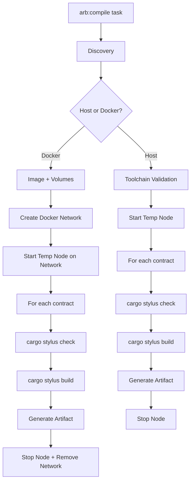

# Compile Plugin

The compile plugin (`hardhat-arb-compile`) handles Stylus contract compilation. It discovers Rust contracts, compiles them via `cargo-stylus`, and generates Hardhat-compatible artifacts.

---

## Architecture



---

## Modules

```
src/
├── index.ts                    # Plugin definition and task registration
├── type-extensions.ts          # Extends StylusConfig with compile options
├── config/                     # Configuration resolution
├── hook-handlers/              # Config hook
├── tasks/
│   └── compile.ts              # Main task orchestration
└── utils/
    ├── discovery/              # Find Stylus contracts
    ├── toolchain/              # Validate host Rust tools
    ├── compiler/
    │   ├── host.ts             # Host compilation
    │   ├── container.ts        # Docker compilation
    │   └── image-builder.ts    # Build the compile Docker image
    ├── abi/                    # ABI export and parsing
    └── stylus-artifacts/       # Artifact generation and saving
```

---

## Discovery

`discoverStylusContracts()` scans the `contracts/` directory:

1. Recursively finds directories with `Cargo.toml` (skips `target/` and hidden dirs)
2. Parses `Cargo.toml` with `smol-toml` - checks if `stylus-sdk` is in dependencies
3. Reads `rust-toolchain.toml` to get the required Rust version
4. Optionally filters by contract name (from `--contracts` flag)

```typescript
const contracts = await discoverStylusContracts(contractsDir, {
  contracts: ['my-counter'], // optional filter
});
// Returns: [{ name: 'my-counter', path: '/abs/path', toolchain: '1.93.0' }]
```

Non-Stylus Cargo projects are silently skipped. Missing `rust-toolchain.toml` throws an error.

---

## Compilation: Host Path

When `--host` is used:

1. **Validate toolchains** - `validateAllToolchains()` checks all requirements upfront:
   - `rustup` installed
   - `cargo-stylus` installed
   - Each required toolchain installed
   - `wasm32-unknown-unknown` target installed per toolchain

2. **Start temp node** - Calls `arb:node start` with `detach: true` and random ports

3. **For each contract:**
   - `cargo +{toolchain} stylus check` - Validates against the running node
   - `cargo +{toolchain} stylus build` - Compiles to WASM
   - Generate artifact (ABI + WASM hex)

4. **Cleanup** - Stops the temporary node

```typescript
// host.ts - core compile flow
await execWithProgress(`cargo +${toolchain} stylus check`, {
  cwd: contractPath,
});
await execWithProgress(`cargo +${toolchain} stylus build`, {
  cwd: contractPath,
});

// WASM output: target/wasm32-unknown-unknown/release/{name}.wasm
// Note: Cargo converts hyphens to underscores in the filename
```

---

## Compilation: Docker Path

When using Docker (the default):

1. **Ensure volumes** - Creates `stylus-compile-rustup` and `stylus-compile-cargo` Docker volumes for caching

2. **Build image** - `ensureCompileImage()` builds `stylus-compile:latest` from `rust:slim` with `cargo-stylus`. Only builds once (cached).

3. **Create network** - A temporary Docker network lets the compile container reach the node container by hostname

4. **Start temp node** - Same as host mode, but attached to the Docker network

5. **For each contract:**
   - Install toolchain in container (`rustup toolchain install {version}`) - cached in volume
   - Add `wasm32-unknown-unknown` target - cached in volume
   - `cargo stylus check --endpoint http://{nodeContainer}:8547`
   - `cargo stylus build`
   - Generate artifact using container for ABI export too

6. **Cleanup** - Stops node, removes Docker network

```typescript
// container.ts - runs commands inside Docker containers
await runInContainer(
  imageName,
  contractPath,
  ['cargo', `+${toolchain}`, 'stylus', 'check', '--endpoint', rpcEndpoint],
  options,
);
```

Each `runInContainer` call starts a temporary container with the contract directory mounted at `/workspace` and the cache volumes mounted.

---

## Artifact Generation

After successful compilation:

1. **ABI export** - Runs `cargo stylus export-abi` to get a Solidity interface
2. **Parse ABI** - `parseAbiFromSolidity()` converts the Solidity interface to JSON ABI format (functions, events, parameter types)
3. **Read WASM** - Reads the compiled `.wasm` file and converts to hex
4. **Save** - Writes `artifacts/contracts/{name}/{name}.json`

```typescript
// Artifact format
{
  _format: 'hh3-stylus-artifact-1',
  contractName: 'my-counter',
  sourceName: 'contracts/my-counter',
  abi: [...],              // Parsed from Solidity interface
  bytecode: '0x...',       // WASM as hex
  deployedBytecode: '0x...', // Same as bytecode
  linkReferences: {},
  deployedLinkReferences: {}
}
```

Artifact generation is best-effort - if ABI export fails, the artifact still gets an empty ABI. If the entire artifact step fails, a warning is printed but compilation is considered successful.

---

## Integration Points

The compile plugin depends on two sibling packages:

- **`hardhat-arb-node`** - Provides `arb:node start` for temporary nodes, plus `generateTempContainerName`, `registerTempContainer`, and `cleanupTempContainer` for lifecycle management
- **`hardhat-arb-utils`** - Provides `DockerClient` for Docker operations and `createPluginError` for standardized error handling
