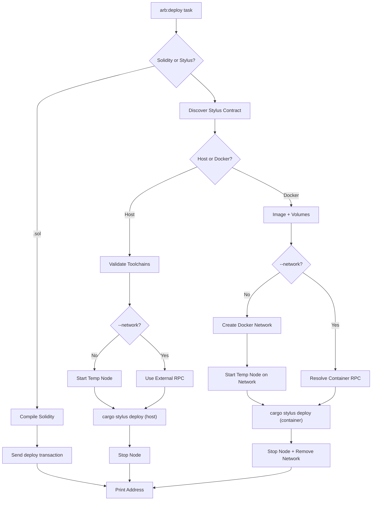

# Deploy Plugin

The deploy plugin (`hardhat-arb-deploy`) handles contract deployment. It supports both Solidity and Stylus contracts, manages ephemeral nodes, and handles Docker networking for container-based deploys.

---

## Architecture



---

## Modules

```
src/
├── index.ts                    # Plugin definition and task registration
├── type-extensions.ts          # Extends StylusConfig with deploy options
├── config/
│   ├── types.ts                # StylusDeployConfig, StylusDeployUserConfig
│   ├── defaults.ts             # Default values
│   └── resolver.ts             # Merge user config with defaults
├── hook-handlers/
│   └── config.ts               # Config hook - resolves stylus.deploy
├── tasks/
│   └── deploy.ts               # Main task orchestration
└── utils/
    └── deployer/
        ├── types.ts            # WasmDeployResult, ProgressCallback
        ├── solidity.ts         # Solidity artifact lookup + deploy
        ├── wasm-host.ts        # Host cargo stylus deploy
        └── wasm-container.ts   # Docker cargo stylus deploy
```

---

## Task Entry Point

The `arb:deploy` task in `tasks/deploy.ts` orchestrates the full flow. It branches on three dimensions:

1. **Contract type** - Solidity (`.sol`) vs Stylus (folder name)
2. **Deployment mode** - Host vs Docker (for Stylus only)
3. **Network** - Ephemeral node vs external `--network`

```typescript
// Simplified decision tree
const isSol = contract.endsWith('.sol');
const isExternal = externalRpcUrl !== null;
const useHost = host || config.stylus.deploy.useHostToolchain;

if (isSol) deploySolidity(...)
else if (useHost) deployStylusHost(...)
else deployStylusContainer(...)
```

The task handles all lifecycle management: starting/stopping ephemeral nodes, creating/removing Docker networks, and cleaning up on error.

---

## Solidity Deployment

`utils/deployer/solidity.ts` handles Solidity contracts:

1. **Find artifact** - `findSolidityArtifact()` recursively scans `artifacts/` for a JSON file matching the contract name. Skips `.dbg.` files and empty bytecodes.

2. **Encode constructor args** - `encodeConstructorArgs()` reads the ABI constructor, coerces string arguments to typed values, and ABI-encodes them.

3. **Deploy** - `deploySolidityContract()` creates a viem wallet client, sends a deploy transaction (bytecode + encoded args), and waits for the receipt.

```typescript
// Constructor arg coercion (Foundry-style)
// uint/int → BigInt, bool → true/false, address/bytes/string → pass-through
function parseConstructorArg(value: string, abiType: string): unknown { ... }
```

The encoding uses `encodeAbiParameters` from `hardhat-arb-utils`, which wraps viem's ABI encoding.

---

## Stylus Host Deployment

`utils/deployer/wasm-host.ts` handles host-mode Stylus deployment:

1. **Build command** - Assembles `cargo +{toolchain} stylus deploy` with endpoint, private key, and `--no-verify`
2. **Execute** - Runs via `execWithProgress` from `hardhat-arb-utils/stylus`, streaming progress lines
3. **Parse address** - `parseDeployedAddress()` extracts the contract address from cargo-stylus output using multiple regex patterns

```typescript
// Address parsing - tries several patterns from cargo-stylus output
const patterns = [
  /deployed code at address:\s*(0x[0-9a-fA-F]{40})/i,
  /contract deployed at\s*(0x[0-9a-fA-F]{40})/i,
  /deployed at[:\s]+(0x[0-9a-fA-F]{40})/i,
  /(0x[0-9a-fA-F]{40})/, // fallback
];
```

`parseDeployedAddress` is shared between host and container modes.

---

## Stylus Container Deployment

`utils/deployer/wasm-container.ts` handles Docker-mode Stylus deployment:

1. **Prepare toolchain** - Runs `rustup toolchain install` and `rustup target add wasm32-unknown-unknown` in a container (cached in volumes)
2. **Deploy** - Runs `cargo stylus deploy` in a temporary container

The deploy container uses the same image and volumes as the compile plugin:

```typescript
// Container setup
const args = ['run', '--rm', '--name', containerName];
args.push('-v', `${contractPath}:/workspace:rw`);
args.push('-v', `${RUSTUP_VOLUME_NAME}:/usr/local/rustup:rw`);
args.push('-v', `${CARGO_VOLUME_NAME}:/usr/local/cargo:rw`);
args.push('-w', '/workspace');
args.push(imageName, ...command);
```

### Docker Networking

The container needs to reach the RPC endpoint. Three scenarios:

| Scenario               | How it works                                                         |
| ---------------------- | -------------------------------------------------------------------- |
| Ephemeral node         | Container joins the Docker network; uses node container name as host |
| External localhost URL | `--add-host=host.docker.internal:host-gateway`; URL rewritten        |
| External remote URL    | Passed directly to container                                         |

```typescript
// Localhost detection and rewriting
if (isLocalhostUrl(externalRpcUrl)) {
  containerOpts = {
    rpcEndpoint: toDockerHostUrl(externalRpcUrl), // → host.docker.internal
    useHostGateway: true,
  };
} else {
  containerOpts = { rpcEndpoint: externalRpcUrl };
}
```

---

## Network and Key Resolution

### `resolveExternalRpcUrl()`

Shared helper in `hardhat-arb-utils/task-helpers` (used by both compile and deploy):

- If `--network` is `undefined` or `"default"` → returns `null` (ephemeral node mode)
- Otherwise → looks up the network config, validates it's an HTTP network, returns the URL
- Accepts a `context` string for error messages (e.g. `"compilation"`, `"deployment"`)

### `resolveDeployPrivateKey()`

- **Ephemeral mode** - Uses `HARDHAT_ACCOUNTS[0].privateKey` (pre-funded on the temp node)
- **External mode** - Reads `accounts[0]` from the network config
  - `"remote"` accounts → error with config example
  - Empty array → error
  - HD wallet → error
  - Explicit key array → returns the first key

---

## Integration Points

The deploy plugin depends on two sibling packages:

- **`hardhat-arb-node`** - Provides `arb:node start` for temporary nodes, plus `generateTempContainerName`, `registerTempContainer`, `cleanupTempContainer`, `generateRandomPort`, and `HARDHAT_ACCOUNTS`
- **`hardhat-arb-utils`** - Provides `DockerClient` for Docker operations, `createPluginError` for error handling, `isLocalhostUrl` / `toDockerHostUrl` for URL rewriting, viem wrappers for transactions, and Stylus utilities (`discoverStylusContracts`, `ensureVolumes`, `ensureCompileImage`, `validateAllToolchains`, `execWithProgress`)
