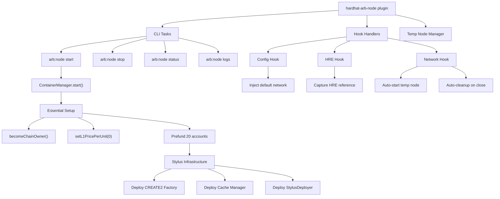

# Node Plugin

The node plugin (`hardhat-arb-node`) manages local Arbitrum nitro-devnode containers. It provides CLI tasks, automatic node lifecycle via Hardhat hooks, temporary container management, and Stylus infrastructure deployment.

---

## Architecture



---

## Modules

```
src/
├── index.ts                    # Plugin definition, task registration, re-exports
├── type-extensions.ts          # Extends StylusConfig with node options
├── temp-node.ts                # Temporary container lifecycle management
├── constants/
│   └── bytecode.ts             # CREATE2 factory, Cache Manager, StylusDeployer bytecodes
├── config/
│   ├── types.ts                # ArbNodeConfig, ArbNodeUserConfig, DevAccount
│   ├── defaults.ts             # Default config, HARDHAT_ACCOUNTS, CONTAINER_NAME
│   └── resolver.ts             # Merge user config with defaults
├── hook-handlers/
│   ├── config.ts               # Config hook: default network + config resolution
│   ├── hook-state.ts           # Random port generation for hook nodes
│   ├── hre.ts                  # HRE hook: captures HRE for network hook
│   └── network.ts              # Network hook: auto-start/stop temp nodes
├── tasks/
│   ├── start.ts                # Start node + setup + Stylus infra
│   ├── stop.ts                 # Stop and remove container
│   ├── status.ts               # Check if node is running
│   └── logs.ts                 # Stream or show container logs
└── utils/
    ├── transactions.ts         # Precompile calls, contract deployment, RPC helpers
    ├── chain-setup.ts          # performEssentialSetup(), prefundAccounts()
    ├── chain-infra.ts          # deployCreate2Factory(), deployCacheManager(), deployStylusDeployer()
    └── startup-info.ts         # printStartupInfo()
```

---

## Node Startup Flow

The `arb:node start` task in `tasks/start.ts` performs the full setup:

1. **Port check** - Verifies HTTP and WebSocket ports are available
2. **Container start** - Uses `ContainerManager` to pull the image, create and start the container, then run a readiness check (HTTP probe with 60s timeout)
3. **Essential setup** - Calls `becomeChainOwner()` on ArbDebug precompile, then `setL1PricePerUnit(0)` on ArbOwner
4. **Prefund accounts** - Sends 10 ETH to each of the 20 Hardhat accounts from the devAccount (#20)
5. **Stylus infrastructure** - Deploys CREATE2 Factory, Cache Manager, and StylusDeployer
6. **Output** - Prints accounts and connection info
7. **Attach or detach** - Streams logs unless `--detach` is set

```typescript
// Simplified startup flow
const containerInfo = await manager.start(containerConfig);
await performEssentialSetup(rpcUrl, devKey, quiet);
await prefundAccounts(rpcUrl, devKey, quiet);
await deployCreate2Factory(rpcUrl, devKey, quiet);
await deployCacheManager(rpcUrl, devKey, quiet);
await deployStylusDeployer(rpcUrl, devKey, quiet);
```

---

## Stylus Infrastructure

Every node start deploys three contracts needed for Stylus:

| Contract        | Address                                      | Purpose                           |
| --------------- | -------------------------------------------- | --------------------------------- |
| CREATE2 Factory | `0x4e59b44847b379578588920ca78fbf26c0b4956c` | Deterministic contract deployment |
| Cache Manager   | dynamic                                      | WASM caching for Stylus contracts |
| StylusDeployer  | `0xcEcba2F1DC234f70Dd89F2041029807F8D03A990` | Deployment helper (via CREATE2)   |

The CREATE2 Factory uses a pre-signed transaction (no private key needed). The Cache Manager is registered on the ArbOwner precompile via `addWasmCacheManager()`. The StylusDeployer is deployed via CREATE2 for a deterministic address.

---

## Hook System

The node plugin uses three hooks to integrate with Hardhat's lifecycle:

### Config Hook (`hook-handlers/config.ts`)

Two responsibilities:

1. **`extendUserConfig`** - Injects a `default` network pointing to a random port (10000-60000). This port is unique per process, so CLI nodes and hook nodes never conflict.

2. **`resolveUserConfig`** - Merges `stylus.node` user config with defaults via `resolveArbNodeConfig()`.

```typescript
// The default network always points to the hook's random port
const arbNodeNetwork: HttpNetworkUserConfig = {
  type: 'http',
  url: `http://127.0.0.1:${hookHttpPort}`,
  chainId,
  accounts: HARDHAT_ACCOUNTS.map((acc) => acc.privateKey),
};
```

### HRE Hook (`hook-handlers/hre.ts`)

Captures the `HardhatRuntimeEnvironment` on creation. The network hook needs this reference to call `arb:node start` programmatically.

### Network Hook (`hook-handlers/network.ts`)

Three handlers:

1. **`newConnection`** - When connecting to the default network: checks if a temp container is already active, if the node is already running on the hook port, or if it needs to start a new temp container.

2. **`closeConnection`** - Cleans up any temp container created for the connection.

3. **`onRequest`** - Intercepts `hardhat_getAutomine` and returns `true`. The nitro-devnode mines one block per transaction, so reporting it as automined prevents tools from waiting for multiple confirmations.

---

## Temp Node Manager (`temp-node.ts`)

Manages ephemeral containers with automatic cleanup:

- **`generateTempContainerName()`** - Creates names like `nitro-devnode-tmp-a1b2c3d4`
- **`registerTempContainer()`** / **`unregisterTempContainer()`** - Track containers for cleanup
- **`cleanupTempContainer()`** - Stop and remove a specific container
- **`cleanupAllTempContainers()`** - Stop all tracked containers on exit
- **`ensureExitHandlerRegistered()`** - Registers `SIGINT`, `SIGTERM`, and `beforeExit` handlers

```typescript
// Exit handlers ensure containers are cleaned up even on Ctrl+C
process.on('SIGINT', () => void cleanup().then(() => process.exit(130)));
process.on('SIGTERM', () => void cleanup().then(() => process.exit(143)));
```

This module is re-exported by the plugin and used by both the compile and deploy plugins for their ephemeral nodes.

---

## Hook-State Port Management (`hook-handlers/hook-state.ts`)

Each process gets its own random HTTP port (10000-60000) for hook-managed nodes. This ensures:

- **No port conflicts** between CLI nodes (`arb:node start` on port 8547) and hook nodes
- **No conflicts** between parallel test/script runs
- **Clean separation** between manually managed and auto-managed nodes

```typescript
let hookHttpPort: number | null = null;

export function getHookHttpPort(): number {
  if (hookHttpPort === null) {
    hookHttpPort = generateRandomPort(); // 10000-60000
  }
  return hookHttpPort;
}
```

The `generateRandomPort()` function is also re-exported for use by compile and deploy plugins.

---

## Transaction Utilities (`utils/transactions.ts`)

Low-level RPC helpers for chain setup:

| Function                | Purpose                                            |
| ----------------------- | -------------------------------------------------- |
| `createNodeClient()`    | Creates a viem wallet client for the local node    |
| `becomeChainOwner()`    | Calls ArbDebug precompile to gain owner privileges |
| `setL1PricePerUnit()`   | Sets L1 gas price to 0 on ArbOwner precompile      |
| `sendEth()`             | Sends ETH from one account to another              |
| `deployContract()`      | Deploys a contract with raw bytecode               |
| `deployViaCreate2()`    | Deploys via the CREATE2 factory                    |
| `addWasmCacheManager()` | Registers a Cache Manager on ArbOwner              |

All functions use viem under the hood via `hardhat-arb-utils` wrappers.

---

## Re-exports

The plugin re-exports utilities for use by sibling plugins (compile, deploy):

```typescript
// Temp node management
export { generateTempContainerName, registerTempContainer, cleanupTempContainer, ... } from './temp-node.js';

// Port generation
export { generateRandomPort } from './hook-handlers/hook-state.js';

// Pre-funded accounts
export { HARDHAT_ACCOUNTS } from './config/defaults.js';
```

This makes `hardhat-arb-node` the central dependency for any plugin that needs to spin up ephemeral nodes.

---

## Integration Points

- **`hardhat-arb-utils`** - Provides `ContainerManager`, `DockerClient`, `createPluginError`, and viem wrappers (`createChain`, `createWalletClientFromKey`, `encodeFunctionData`, etc.)
- **`hardhat-arb-compile`** - Calls `arb:node start` for temporary compilation nodes. Uses `generateTempContainerName`, `registerTempContainer`, `cleanupTempContainer`.
- **`hardhat-arb-deploy`** - Calls `arb:node start` for temporary deployment nodes. Uses the same temp-node utilities plus `HARDHAT_ACCOUNTS` and `generateRandomPort`.
