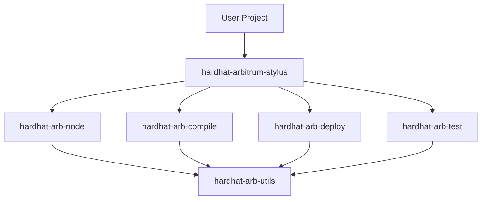

# Our Packages

We use a **toolbox pattern**: one main package bundles several focused plugins.



---

## Package Overview

| Package | Purpose |
|---------|---------|
| `hardhat-arbitrum-stylus` | Toolbox — users install this one |
| `hardhat-arb-node` | Local node management |
| `hardhat-arb-compile` | Contract compilation |
| `hardhat-arb-deploy` | Deployment |
| `hardhat-arb-test` | Test runner |
| `hardhat-arb-utils` | Shared utilities |

---

## The Toolbox

`hardhat-arbitrum-stylus` just bundles the others:

```typescript
const hardhatArbitrumStylusPlugin: HardhatPlugin = {
  id: 'hardhat-arbitrum-stylus',
  dependencies: () => [
    import('@cobuilders/hardhat-arb-node'),
    import('@cobuilders/hardhat-arb-compile'),
    import('@cobuilders/hardhat-arb-deploy'),
    import('@cobuilders/hardhat-arb-test'),
  ],
  npmPackage: '@cobuilders/hardhat-arbitrum-stylus',
};
```

Users install one package, get everything.

---

## Shared Utilities

`hardhat-arb-utils` provides common code:

- **Container** — Docker client and lifecycle management
- **Errors** — Standardized `HardhatPluginError` creation
- **Web3** — RPC helpers and viem client
