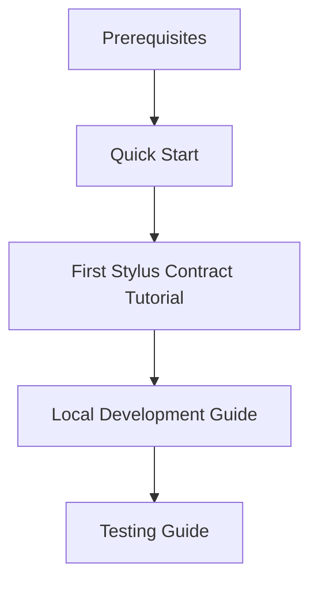

# Tutorials

<!-- 
=============================================================================
CONTENT DESCRIPTION FOR DOCUMENTATION AGENT
=============================================================================

This is the index page for the Tutorials section.

WHAT TO WRITE:
- Overview of available tutorials
- What makes tutorials different from guides
- Learning path recommendations
- Prerequisites for tutorials

SECTIONS TO INCLUDE:

1. What are Tutorials?
   - Learning-oriented documentation
   - Step-by-step with explanations
   - Building complete projects

2. Available Tutorials
   - List with descriptions and difficulty levels

3. Prerequisites
   - What you need to know before starting
   - Required setup

4. Learning Path
   - Recommended order of tutorials

=============================================================================
-->

Tutorials are step-by-step lessons that teach you concepts by building real projects.

## About Tutorials

Tutorials are **learning-oriented**. Unlike [guides](../guides/index.md) which focus on accomplishing specific tasks, tutorials walk you through complete projects from start to finish, explaining concepts along the way.

## Available Tutorials

### [Your First Stylus Contract](first-stylus-contract.md)

Build and deploy a complete Stylus contract from scratch.

| | |
|---|---|
| **Difficulty** | Beginner |
| **Time** | 30-45 minutes |
| **You'll Learn** | Project setup, Stylus basics, local deployment |

## Prerequisites

Before starting tutorials, ensure you have:

- [Prerequisites](../getting-started/prerequisites.md) installed
- [Plugin installed](../getting-started/installation.md)
- Basic familiarity with:
  - Command line
  - Rust (for Stylus contracts)
  - TypeScript/JavaScript

## Learning Path

1. Complete [Quick Start](../getting-started/quick-start.md)
2. Follow [Your First Stylus Contract](first-stylus-contract.md) tutorial
3. Read the [Local Development Guide](../guides/local-development.md)

## Request a Tutorial

Want to see a tutorial on a specific topic? [Open an issue](https://github.com/CoBuilders-xyz/hardhat-arbitrum-stylus/issues) with your suggestion.
